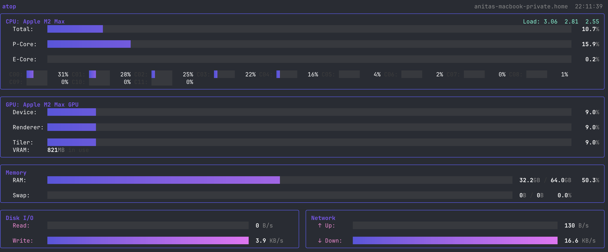

# atop

A real-time system performance monitor for macOS, written in Go. Inspired by [asitop](https://github.com/tlkh/asitop) — no `sudo` required.

[](https://github.com/anitabendelja/atop/actions/workflows/ci.yml)




## Features

- **CPU** — total usage bar, per-core grid; Apple Silicon shows P-core vs E-core averages
- **GPU** — device, renderer, and tiler utilization via `ioreg` (works on Apple Silicon and discrete GPUs)
- **Memory** — RAM and swap usage with sizes
- **Disk I/O** — read/write bytes per second across all disks
- **Network** — upload/download bytes per second
- **Load averages** — 1 / 5 / 15 minute
- Rainbow colour theme with per-section accent colours; bars shift to yellow/red at high load
- Configurable refresh interval
- No root or `sudo` required

## Requirements

- macOS (Apple Silicon or Intel)
- Go 1.21+

## Install

```bash
git clone https://github.com/anitabendelja/atop
cd atop
go build -o atop .
```

Or run directly:

```bash
go run .
```

## Usage

```
atop [flags]

Flags:
  -i, --interval duration   refresh interval (default 1s)
  -h, --help                help
```

**Examples**

```bash
atop              # 1 second refresh
atop -i 500ms     # 500 ms refresh
atop -i 2s        # 2 second refresh
```

Press `q` or `Ctrl+C` to quit.

## How it works

| Metric   | Source                              |
|----------|-------------------------------------|
| CPU      | `gopsutil` (`host_processor_info`)  |
| GPU      | `ioreg -r -c IOAccelerator`         |
| Memory   | `gopsutil` (`vm_statistics64`)      |
| Disk I/O | `gopsutil` (`IOKit`)                |
| Network  | `gopsutil` (`net_io_counters`)      |
| Load     | `sysctl vm.loadavg`                 |

## Built with

- [cobra](https://github.com/spf13/cobra) — CLI
- [bubbletea](https://github.com/charmbracelet/bubbletea) — TUI framework
- [lipgloss](https://github.com/charmbracelet/lipgloss) — terminal styling
- [gopsutil](https://github.com/shirou/gopsutil) — system metrics
